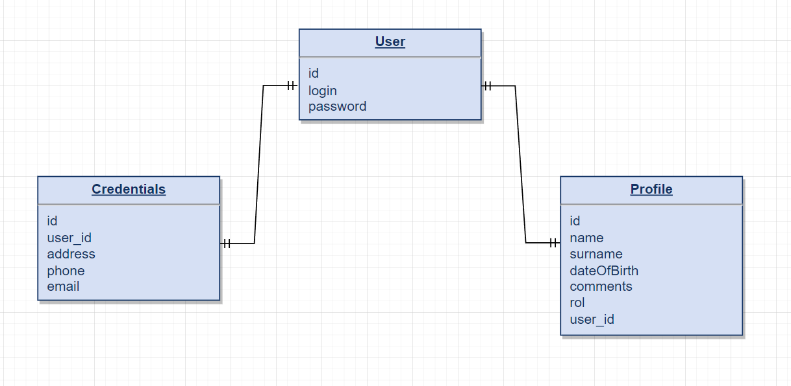

# test3-2

- [Objetivo](#objetivo)
- [Diagrama base de datos](#diagrama-base-de-datos)
  * [Explicación](#explicación)
- [Node Script](#node-script)
  * [How to run](#how-to-run)

## Objetivo
Generar un diagrama de base de datos dado el siguiente modelo:
- User:
  - login
  - Password
- Profile:
  - name
  - surname
  - dateOfBirth
  - Comments
  - rol
- Creedentials:
  - address
  - phone
  - email

## Diagrama base de datos

  ### Explicación
  - Relación entre user y credenciales: 1 a 1 ya que unas credenciales sólo pueden pertenecer a un único usuario y un usuario sólo puede tener unas credenciales ya que tanto address como phone y email pertenecen a una misma fila.
  - Relación entre user y profile: 1 a 1 ya que un usuario sólo puede tener un perfil y un perfil sólo puede pertenecer a un usuario. El único caso donde se podría considerar que un usuario pudiese tener más de un perfil sería en algún tipo de aplicación que así lo permitiese, pero según la información que tenemos no es así.

## Node Script

  ### How to run
  - cd nodeScript
  - npm i
  - node index.js